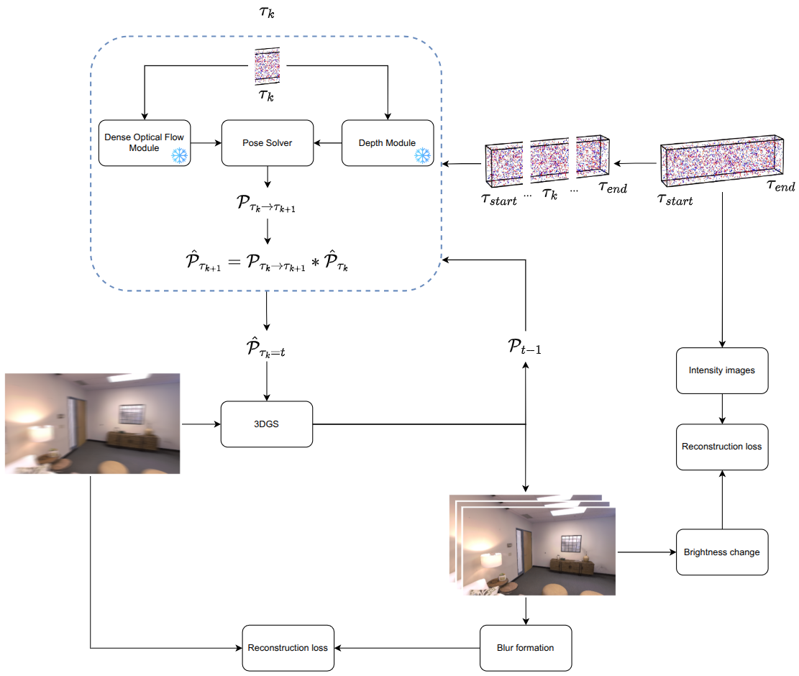
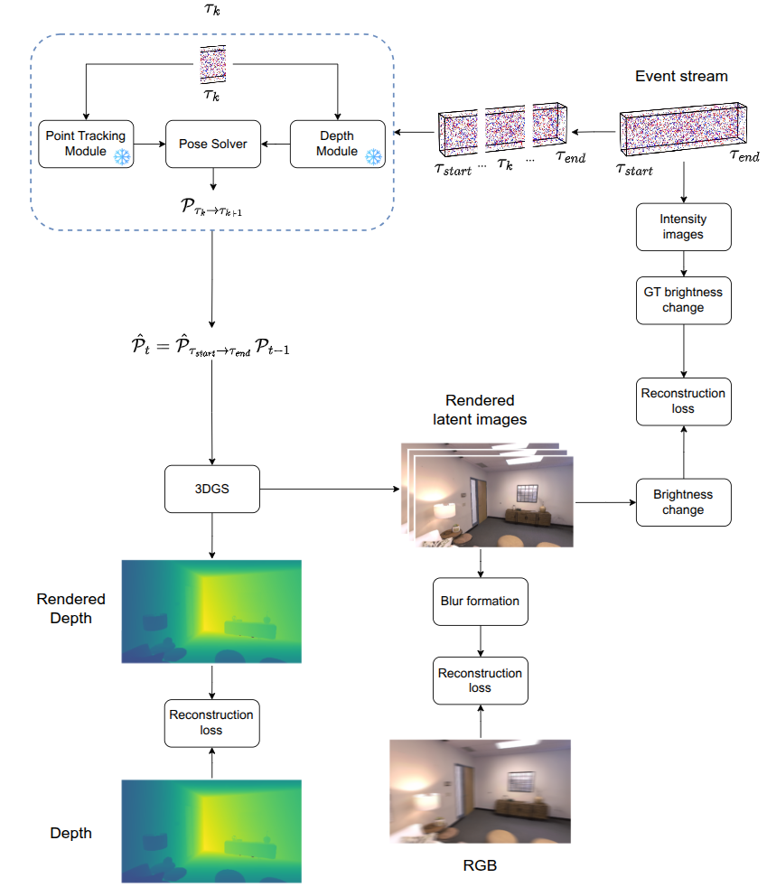

# SfM-free 3DGS-SLAM with RGBD and event sensors

## Introduction

Standard SfM-free 3DGS SLAM breaks under blur and low light conditions. To address this, recent research focuses on leveraging the event sensor that is largely blur-free and gives meaningful signal in scenes with low light. However, a downside of state-of-the-art in this line of work is implicit camera trajectory optimization via RGBD reconstruction losses. When the viewpoints become sparse (e.g., due to high resolution of RGBD frames that reduces camera's bandwidth), the mapping performance is strong, while camera tracking becomes the bottleneck. Sparse views break the common assumption of marginal difference in camera poses between subsequent steps.

This work explores possible ways for dealing with the problem of sparsity in 3DGS-SLAM from RGBD and event data. Assuming that RGBD frames are sparse while events are temporally dense by definition, we propose to extract an update the camera pose from the event stream. The main insight is that relative pose priors (for example, from an optical flow) significantly improve the tracking performance in sparse viepoint settings, with up to ~2.5x improvement compared to a SOTA baseline. EGS-SLAM [1] is taken as a SOTA RGBD+E pipeline for 3DGS-SLAM.

## System overview

The diagram below shows a high-level system:

At each timestep, the system receives a blurry RGBD frame and a stream of events. These inputs are used for optimizing 3D Gaussian Splatting (3DGS) to track the camera pose (tracking stage) and reconstruct the scene (mapping stage). The output is an updated 3DGS map and the camera pose at the current timestep. Our work contributes to improving the tracking stage. Note that the mapping stage also refines the camera pose after tracking [2].

The tracking stage is structured as follows:

where camera pose at timestep $t$ is denoted as $P_t$, event interval is between timesteps $\tau_{start}$ and $\tau_{end}=t$, batch of events from the interval is $\tau_{k}$. The mapping stage has almost the same structure, working without our pose tracking module.

The pipeline processes an incoming blurry RGB frame at timestep $t$ as follows:

1. The camera pose is propagated from the previous timestep $P_{t-1}$ to the current timestep $P_t$ using an event-based pose tracker that operates on event batches to estimate relative camera poses.

2. The propagated pose $P_t$ is then refined using EGS-SLAM's pose optimization module, which utilizes RGBD and event data to optimize the camera pose. The approach uses three reconstruction losses:

    - Blurry RGB reconstruction loss: 3DGS renders several sharp latent images during the camera exposure interval when the blurry RGB frame is captured. These latent images are averaged to form the blurry image, which is then compared to the input RGB frame.
    - Depth reconstruction loss: ensures that the rendered depth map from the 3DGS map aligns with the input depth frame.
    - Brightness change loss: reconstructs the changes in brightness between intensity images obtained from events and rendered latent images.

The main addition to EGS-SLAM is the event-based pose tracker that estimates relative camera poses between two timestamps before the tracking stage. Leveraging this prior on $P_t$, the pose optimization step of EGS-SLAM refined it during the tracking and mapping stages, removing the accumulated drift from the event-based tracker.

## Experimental setup & Baselines

TBD

## Key Observation: Where EGS-SLAM Fails

TBD

## Attacking Pose Propagation

TBD

## Secondary Experiments & Side Insights

TBD

## Limitations

TBD

## Takeaways & Future Directions (Interview Gold)

TBD

## References

1. [EGS-SLAM: RGB-D Gaussian Splatting SLAM with Events](https://arxiv.org/abs/2508.07003)
2. [BAD-Gaussians: Bundle Adjusted Deblur Gaussian Splatting](https://arxiv.org/html/2403.11831v2)