# SfM-free 3DGS-SLAM with RGBD and event sensors

## Introduction

Standard SfM-free 3DGS SLAM breaks under blur and low light conditions. To address this, recent research focuses on leveraging the event sensor that is largely blur-free and gives meaningful signal in scenes with low light. However, a downside of state-of-the-art in this line of work is implicit camera trajectory optimization via RGBD reconstruction losses. When the viewpoints become sparse (e.g., due to high resolution of RGBD frames that reduces camera's bandwidth), the mapping performance is strong, while camera tracking becomes the bottleneck. Sparse views break the common assumption of marginal difference in camera poses between subsequent steps.

This work explores possible ways for dealing with the problem of sparsity in 3DGS-SLAM from RGBD and event data. Assuming that RGBD frames are sparse while events are temporally dense by definition, we propose to extract an update the camera pose from the event stream. The main insight is that relative pose priors (for example, from an optical flow) significantly improve the tracking performance in sparse viepoint settings, with up to ~2.5x improvement compared to a SOTA baseline. EGS-SLAM [1] is taken as a SOTA RGBD+E baseline for 3DGS-SLAM.

## System overview

The diagram below shows a high-level system:

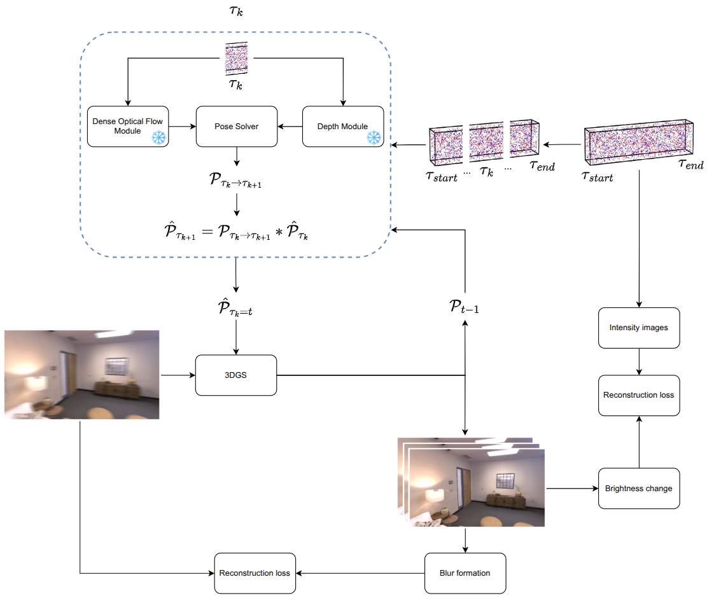

At each timestep, the system receives a blurry RGBD frame and a stream of events. These inputs are used for optimizing 3D Gaussian Splatting (3DGS) to track the camera pose (tracking stage) and reconstruct the scene (mapping stage). The output is an updated 3DGS map and the camera pose at the current timestep. Our work contributes to improving the tracking stage. Note that the mapping stage also refines the camera pose after tracking [2].

The tracking stage is structured as follows:

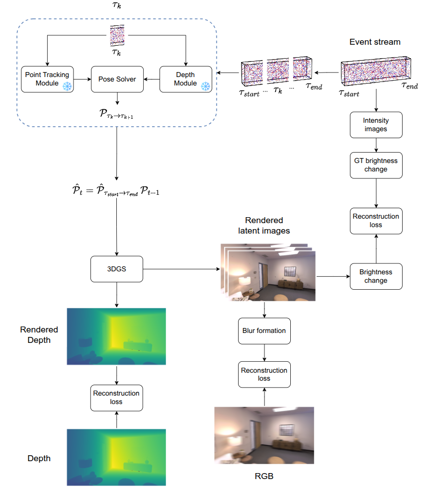

where camera pose at timestep $t$ is denoted as $P_t$, event interval is between timesteps $\tau_{start}$ and $\tau_{end}=t$, batch of events from the interval is $\tau_{k}$. The mapping stage has almost the same structure, working without our pose tracking module.

The pipeline processes an incoming blurry RGB frame at timestep $t$ as follows:

1. The camera pose is propagated from the previous timestep $P_{t-1}$ to the current timestep $P_t$ using an event-based pose tracker that operates on event batches to estimate relative camera poses.

2. The propagated pose $P_t$ is then refined using EGS-SLAM's pose optimization module, which utilizes RGBD and event data to optimize the camera pose. The approach uses three reconstruction losses:

    - Blurry RGB reconstruction loss: 3DGS renders several sharp latent images during the camera exposure interval when the blurry RGB frame is captured. These latent images are averaged to form the blurry image, which is then compared to the input RGB frame.
    - Depth reconstruction loss: ensures that the rendered depth map from the 3DGS map aligns with the input depth frame.
    - Brightness change loss: reconstructs the changes in brightness between intensity images obtained from events and rendered latent images.

The main addition to EGS-SLAM is the event-based pose tracker that estimates relative camera poses between two timestamps before the tracking stage. Leveraging this prior on $P_t$, the pose optimization step of EGS-SLAM refined it during the tracking and mapping stages, removing the accumulated drift from the event-based tracker.

## Experimental setup & baselines

We build our approach on top of EGS-SLAM. We implement the event-based pose tracker with several methods: contrast maximization [6], pretrained models for event-based optical flow [9] or point tracking [11], or a foundational model for RGB optical flow [3] distilled to event inputs following [7]. To test the motion prior efficacy, we created RGB-based baselines with point detection and matching (SuperPoint and Lightglue [8]) and optical flow (Unimatch [3]).

We introduce sparsity by uniformly subsampling frames, picking every 4-/8-/16-th frame of the dataset.

### Evaluation

In the dense setup, we evaluate results following the approach of [1], computing the tracking and reconstruction metrics on non-keyframe frames which are dynamically selected during optimization.

In the sparse setup, unseen frames for evaluation are uniformly selected in between the frames used for optimization. We follow the evaluation approach of [5], where the pose for a given eval frame is interpolated from the two adjacent frames and optimized based on the reconstruction losses.

### Metrics

Pose/Tracking: ATE on camera trajectories [12] (without scale correction).

Reconstruction: PSNR/SSIM/LPIPS on rendered views.

Note that the two sets of metrics are not directly correlated, as good reconstruction can be achieved even with poor camera tracking, since views for reconstruction are rendered at estimated rather than groundtruth (GT) poses.

### Datasets

We evaluate our method using the datasets of [1]:

- EventReplica: synthetic data; seven indoor scenes with 400 frames on average; low/medium motion blur; events generated via ESIM [4].

- DEVD: real data; eight indoor scenes with 365 frames on average; medium/high motion blur.

## Where SOTA fails

We identified two problematic aspects of EGS-SLAM:

- low reconstruction quality on textureless surfaces
- failure to converge to a good camera trajectory in setups with large camera motion

Textureless surfaces is a fundamental problem for event-based methods, as too few events are triggered in these regions, making the event part of the optimization carry noisy information.

The second problem is grounded in how camera poses are optimized. The optimized pose from the timestep `t-1` is taken as initialization at `t`, which is hard to optimize implicitly via rendering-based losses alone. We explore two possible ways of attacking this problem: 

1. Utilize temporally-dense event stream to smoothly propagate camera poses between `t-1` and `t`
2. Impose geometrical constraints when optimizing the pose

## Adding relative pose prior

### Synthetic data experiments

Pose trajectory and rendering quality of EGS-SLAM substantially degrades with increasing frame sparsity:

| Frame Step | ATE (cm) ↓      | PSNR ↑       | SSIM ↑      | LPIPS ↓     |
| ---------- | --------------- | ------------ | ----------- | ----------- |
| 1          | **4.51 ± 2.43** | 27.83 ± 3.61 | 0.83 ± 0.07 | 0.19 ± 0.06 |
| 4          | 63.65 ± 20.51   | 20.47 ± 4.02 | 0.67 ± 0.09 | 0.47 ± 0.11 |
| 8          | 88.05 ± 31.66   | 17.07 ± 3.44 | 0.59 ± 0.10 | 0.62 ± 0.09 |
| 16         | 91.36 ± 29.40   | 14.98 ± 3.14 | 0.52 ± 0.10 | 0.68 ± 0.08 |

An upper-bound for performance with the relative pose update can be obtained via a pretrained RGB optical flow:

| Vanilla EGS-SLAM | Rel.Pose With RGB Opt. Flow | Frame Step | ATE (cm) ↓        | PSNR ↑        | SSIM ↑        | LPIPS ↓       |
|------------------|---------------|-----------|------------------|--------------|--------------|--------------|
| ✓ | ✗ | 1  | 4.51 ± 2.43 | 27.83 ± 3.61 | 0.83 ± 0.07 | 0.19 ± 0.06 |
| ✗ | ✓ | 1  | **2.54 ± 1.49** | **28.59 ± 3.47** | 0.85 ± 0.06 | 0.17 ± 0.06 |
| ✓ | ✗ | 4  | 63.65 ± 20.51 | 20.47 ± 4.02 | 0.67 ± 0.09 | 0.47 ± 0.11 |
| ✗ | ✓ | 4  | 4.39 ± 3.68 | 28.44 ± 3.74 | 0.85 ± 0.06 | 0.19 ± 0.06 |
| ✓ | ✗ | 8  | 88.05 ± 31.66 | 17.07 ± 3.44 | 0.59 ± 0.10 | 0.62 ± 0.09 |
| ✗ | ✓ | 8  | 5.68 ± 3.46 | 27.35 ± 3.47 | 0.83 ± 0.06 | 0.22 ± 0.06 |
| ✓ | ✗ | 16 | 91.36 ± 29.40 | 14.98 ± 3.14 | 0.52 ± 0.10 | 0.68 ± 0.08 |
| ✗ | ✓ | 16 | 40.86 ± 19.27 | 20.05 ± 1.80 | 0.67 ± 0.06 | 0.41 ± 0.10 |

In the sparse view settings, our method based on event-based pose tracking achieves a significant improvement over the baseline in both camera tracking and reconstruction:

| Rel.Pose With Event Tracking | Frame Step | ATE (cm) ↓       | PSNR ↑        | SSIM ↑        | LPIPS ↓       |
|-----------------------|------------|------------------|--------------|--------------|--------------|
| ✗ | 4  | 63.65 ± 20.51 | 20.47 ± 4.02 | 0.67 ± 0.09 | 0.47 ± 0.11 |
| ✓ | 4  | **24.78 ± 15.90** | **24.91 ± 3.76** | 0.78 ± 0.09 | 0.30 ± 0.12 |
| ✗ | 8  | 88.05 ± 31.66 | 17.07 ± 3.44 | 0.59 ± 0.10 | 0.62 ± 0.09 |
| ✓ | 8  | 34.91 ± 17.61 | 23.66 ± 3.45 | 0.76 ± 0.08 | 0.34 ± 0.11 |
| ✗ | 16 | 91.36 ± 29.40 | 14.98 ± 3.14 | 0.52 ± 0.10 | 0.68 ± 0.08 |
| ✓ | 16 | 44.66 ± 21.12 | 21.76 ± 2.84 | 0.71 ± 0.07 | 0.40 ± 0.09 |

Qualitative results on two randomly picked scenes (`office4` and `room0`) from EventReplica:

<table>
<tr>
<td align="center">
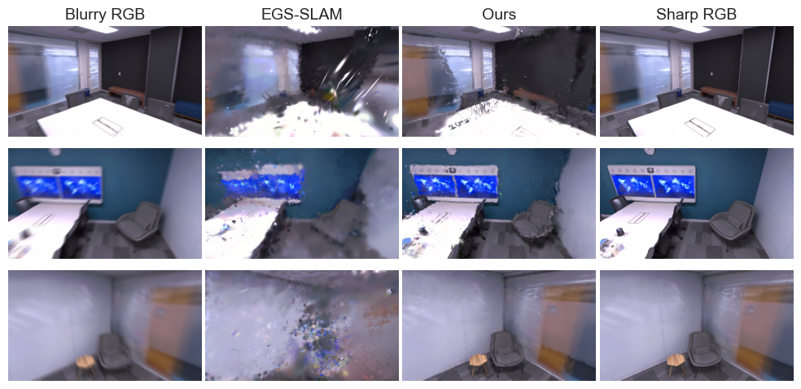
</td>
<td align="center">
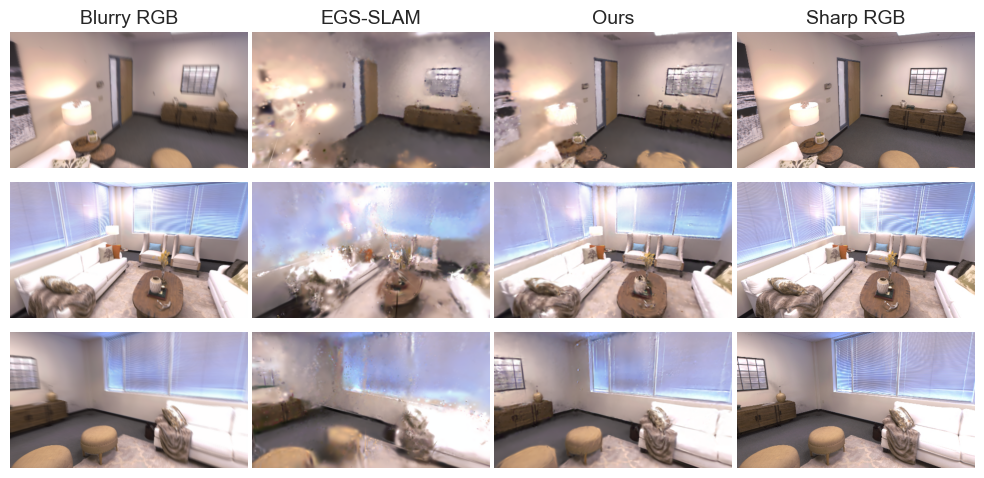
</td>
</tr>

<tr>
<td align="center" colspan="2">
<h4>Frame step = 4</h4>
</td>
</tr>
<tr>
<td align="center">
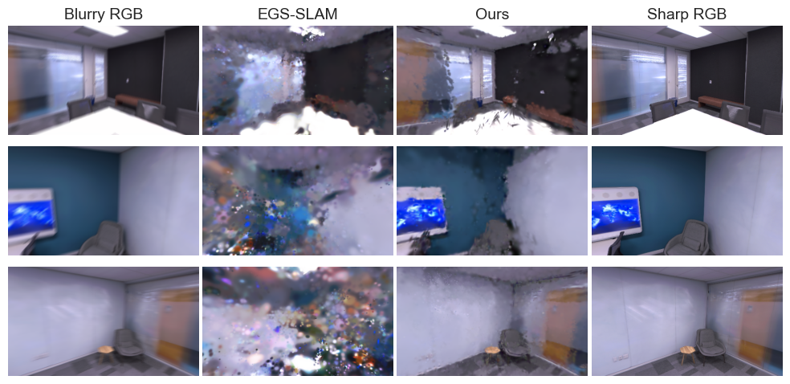
</td>
<td align="center">
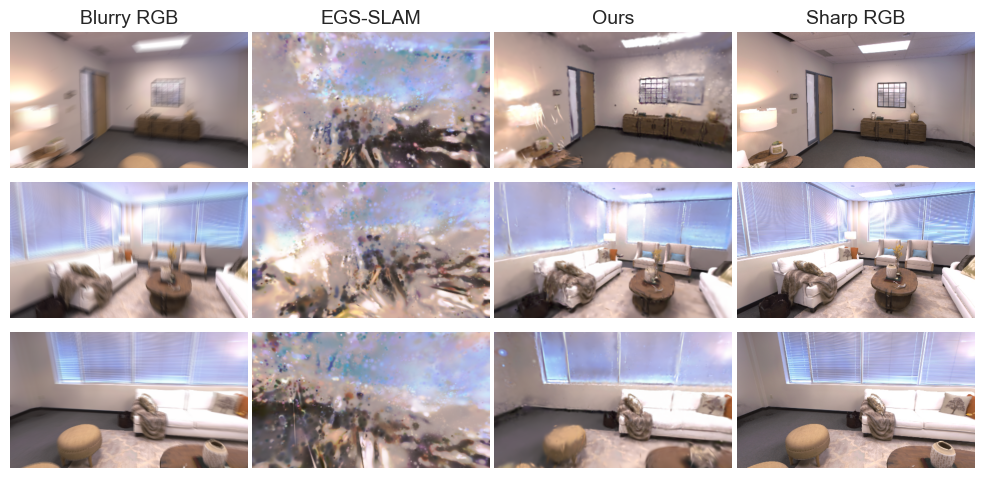
</td>
</tr>

<tr>
<td align="center" colspan="2">
<h4>Frame step = 8</h4>
</td>
</tr>
<tr>
<td align="center">
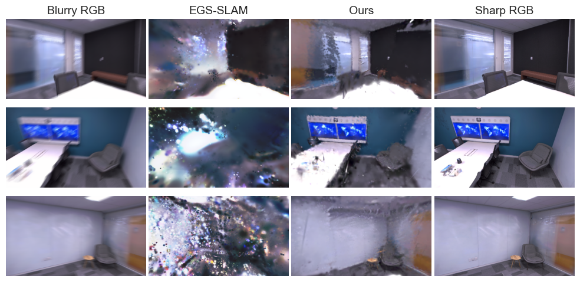
</td>
<td align="center">
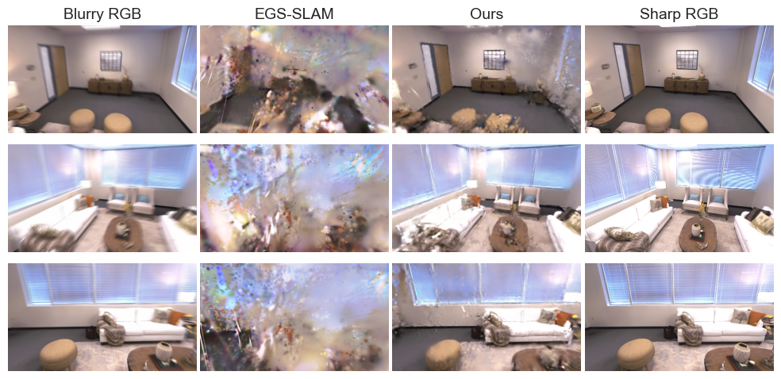
</td>
</tr>

<tr>
<td align="center" colspan="2">
<h4>Frame step = 16</h4>
</td>
</tr>

</table>

Full evaluation subsets used for the scenes above, each video following the same convention as the static images (please click on a gif to open the video):

<table>

<tr>
<td align="center">
<a href="docs/qual_eventreplica_office4_fstep=4.mp4">
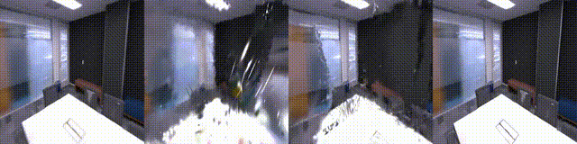
</a>
</td>

<td align="center">
<a href="docs/qual_eventreplica_room0_fstep=4.mp4">
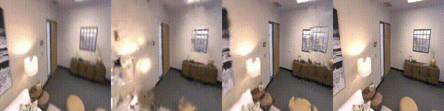
</a>
</td>
</tr>

<tr>
<td align="center" colspan="2">
<b>Frame step = 4</b>
</td>
</tr>

<tr>
<td align="center">
<a href="docs/qual_eventreplica_office4_fstep=8.mp4">
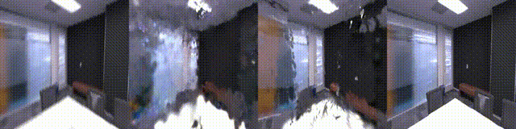
</a>
</td>

<td align="center">
<a href="docs/qual_eventreplica_room0_fstep=8.mp4">
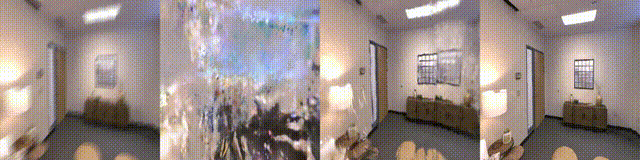
</a>
</td>
</tr>
<tr>
<td align="center" colspan="2">
<h4>Frame step = 8</h4>
</td>
</tr>

<tr>
<td align="center">
<a href="docs/qual_eventreplica_office4_fstep=16.mp4">
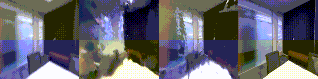
</a>
</td>

<td align="center">
<a href="docs/qual_eventreplica_room0_fstep=16.mp4">
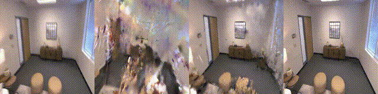
</a>
</td>
</tr>
<tr>
<td align="center" colspan="2">
<h4>Frame step = 16</h4>
</td>
</tr>

</table>

Next we plot camera trajectories for the scenes presented above. Each figure contain a train (left) and eval (right) trajectories at the respective frame sparsity.

<table>

<tr>
<td align="center">
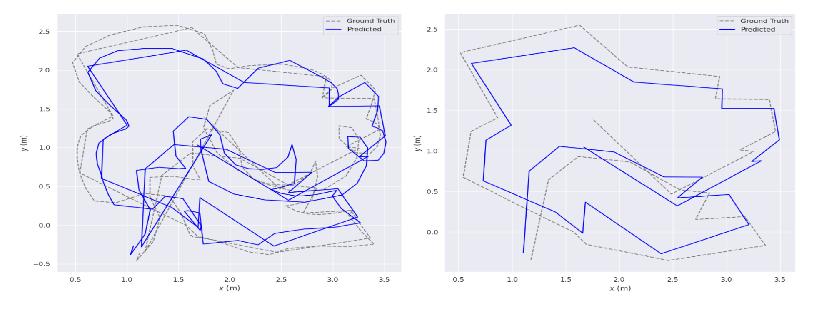
</td>

<td align="center">
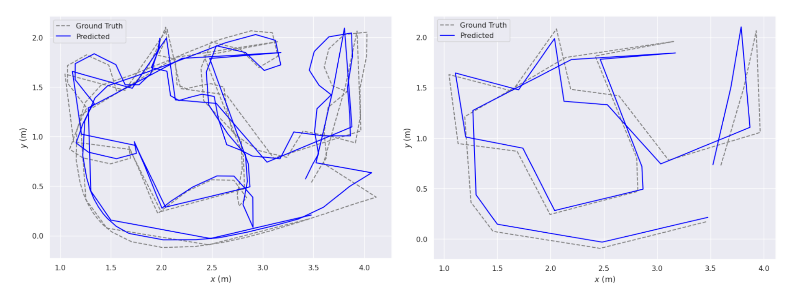
</td>
</tr>

<tr>
<td align="center" colspan="2">
<b>Frame step = 4</b>
</td>
</tr>

<tr>
<td align="center">
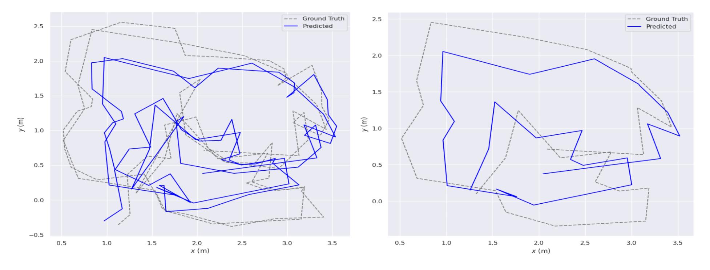
</td>

<td align="center">
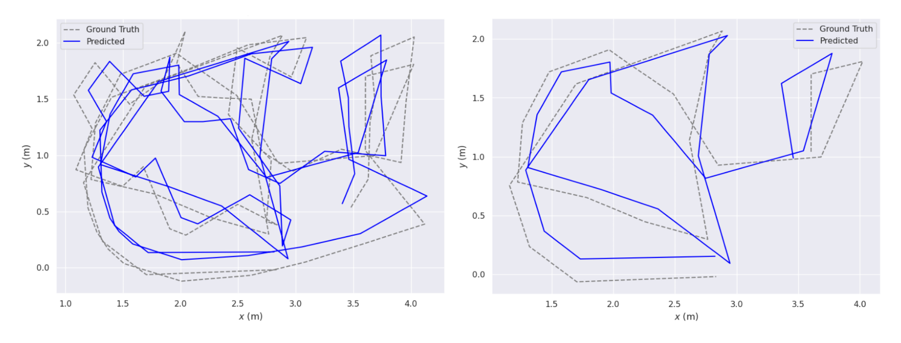
</td>
</tr>

<tr>
<td align="center" colspan="2">
<b>Frame step = 8</b>
</td>
</tr>

<tr>
<td align="center">
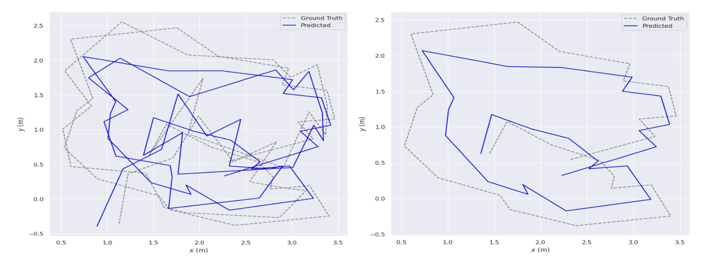
</td>

<td align="center">
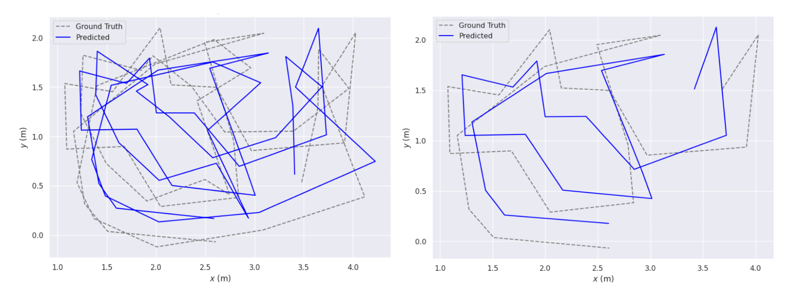
</td>
</tr>

<tr>
<td align="center" colspan="2">
<b>Frame step = 16</b>
</td>
</tr>

</table>

EGS-SLAM does not converge to a meaningful camera trajectory even when every fourth frame is used for optimization:

<table>

<tr>
<td align="center">
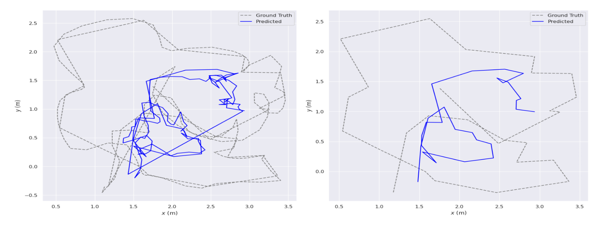
</td>

<td align="center">
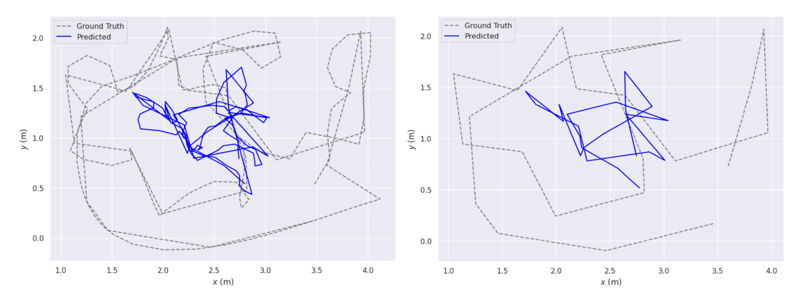
</td>
</tr>

<tr>
<td align="center" colspan="2">
<b>Frame step = 4</b>
</td>
</tr>

</table>

### Real data experiments

In two out of four scenes of the DEVD dataset, `mahjong1` and `testbed1`, we outperform the baseline:

| Interim Event Tracking | Frame Step | ATE (cm) ↓     | PSNR ↑        | SSIM ↑        | LPIPS ↓       |
|------------------------|------------|---------------|--------------|--------------|--------------|
| ✗ | 4  | 18.13 ± 15.17 | 16.99 ± 0.26 | 0.54 ± 0.02 | 0.38 ± 0.04 |
| ✓ | 4  | **4.22 ± 0.99** | 18.63 ± 1.67 | 0.61 ± 0.07 | 0.32 ± 0.11 |
| ✗ | 8  | 35.85 ± 33.25 | 15.65 ± 1.55 | 0.48 ± 0.08 | 0.46 ± 0.03 |
| ✓ | 8  | 9.24 ± 2.04 | 18.51 ± 1.72 | 0.61 ± 0.07 | 0.32 ± 0.12 |
| ✗ | 16 | 33.39 ± 27.64 | 14.07 ± 1.17 | 0.39 ± 0.04 | 0.54 ± 0.02 |
| ✓ | 16 | 12.69 ± 4.17 | 18.29 ± 1.31 | 0.60 ± 0.06 | 0.32 ± 0.10 |

Results on the `mountain1` and `table1` scenes reveal a failure mode of our method with respect to the camera tracking:

| Interim Event Tracking | Frame Step | ATE (cm) ↓      | PSNR ↑        | SSIM ↑        | LPIPS ↓       |
|------------------------|------------|-----------------|---------------|---------------|---------------|
| ✗ | 4  | **42.78 ± 23.08** | 14.34 ± 2.04 | 0.42 ± 0.04 | 0.50 ± 0.03 |
| ✓ | 4  | 341.31 ± 99.99 | **17.92 ± 1.18** | 0.62 ± 0.04 | 0.30 ± 0.01 |
| ✗ | 8  | **49.40 ± 41.17** | 13.26 ± 2.71 | 0.40 ± 0.03 | 0.52 ± 0.05 |
| ✓ | 8  | 337.22 ± 99.90 | **17.86 ± 1.44** | 0.62 ± 0.04 | 0.29 ± 0.04 |
| ✗ | 16 | **49.92 ± 45.52** | 13.60 ± 3.44 | 0.42 ± 0.03 | 0.51 ± 0.10 |
| ✓ | 16 | 334.80 ± 104.57 | **17.38 ± 1.71** | 0.60 ± 0.02 | 0.32 ± 0.04 |

Given insufficient quality of input 2D-3D correspondences, relative poses computed via PnP-RANSAC may introduce irrecoverable drift. On real data, the quality of correspondences is negatively influenced by two factors: sim-to-real generalization of the event tracker and noise from the sensors (event and depth cameras). One of the problematic scenes (`table1`) contains plenty of textureless surfaces which amplify the noise in event tracks. The other scene, `mountain1`, contains multiple objects with an identical appearance, potentially confusing the tracker.

To ensure no catastrophic pose updates are made, computation of relative poses should be safeguarded with a measure of confidence per correspondence, allowing to filter out low-confidence points. This is currently unavailable in the event tracking SOTA.

## Secondary experiments & side insights

### Can relative pose computed from event tracking be improved?

One of the ideas is to refine it with a flow reconstruction objective: after obtaining an initial relative pose between two sparse frames, improve it by optimizing for the optical flow computed between these frames:

| RGB Flow Reconstruction | Frame Step | ATE (cm) ↓        | PSNR ↑        | SSIM ↑        | LPIPS ↓       |
|------------------------|------------|------------------|--------------|--------------|--------------|
| ✗ | 4  | 24.78 ± 15.90 | 24.91 ± 3.76 | 0.78 ± 0.09 | 0.30 ± 0.12 |
| ✓ | 4  | **14.72 ± 18.06** | **26.75 ± 3.87** | 0.81 ± 0.08 | 0.24 ± 0.11 |
| ✗ | 8  | 34.91 ± 17.61 | 23.66 ± 3.45 | 0.76 ± 0.08 | 0.34 ± 0.11 |
| ✓ | 8  | 17.09 ± 18.41 | 27.01 ± 3.29 | 0.82 ± 0.07 | 0.25 ± 0.08 |
| ✗ | 16 | 44.66 ± 21.12 | 21.76 ± 2.84 | 0.71 ± 0.07 | 0.40 ± 0.09 |
| ✓ | 16 | 31.75 ± 27.38 | 24.45 ± 4.25 | 0.77 ± 0.09 | 0.32 ± 0.12 |

### How does a pretrained model for optical flow from events [9] compare to event tracking?

| Event-Based Optical Flow | Frane Step | ATE (cm) ↓     | PSNR ↑        | SSIM ↑        | LPIPS ↓       |
|----------------|------|---------------|--------------|--------------|--------------|
| ✓ | 4  | 67.23 ± 40.59 | 21.74 ± 3.32 | 0.70 ± 0.09 | 0.41 ± 0.09 |
| ✗ | 4  | **24.78 ± 15.90** | **24.91 ± 3.76** | 0.78 ± 0.09 | 0.30 ± 0.12 |
| ✓ | 8  | 91.57 ± 36.87 | 19.52 ± 3.25 | 0.64 ± 0.08 | 0.51 ± 0.06 |
| ✗ | 8  | 34.91 ± 17.61 | 23.66 ± 3.45 | 0.76 ± 0.08 | 0.34 ± 0.11 |
| ✓ | 16 | 104.63 ± 33.39 | 16.44 ± 3.00 | 0.52 ± 0.10 | 0.62 ± 0.08 |
| ✗ | 16 | 44.66 ± 21.12 | 21.76 ± 2.84 | 0.71 ± 0.07 | 0.40 ± 0.09 |

### Does point matching via SuperPoint/LightGlue provide a better upperbound on performance than optical flow?

Point matching is known to not be robust to blur. The results below confirm this hypothesis, showing that the performance of the relative pose prior based on the SOTA point matching of [8] is unstable under blur. Moreover, the results on sharp images are inferior to those of optical flow on blurry images, which may be explained by insufficient quality and confidence of matched points, potentially due to the presense of textureless frames in the EventReplica dataset.

| Sharp RGB Input | Frame Step | ATE (cm) ↓      | PSNR ↑        | SSIM ↑        | LPIPS ↓       |
|-----------|------------|-----------------|---------------|---------------|---------------|
| ✗         | 1          | 48.38 ± 112.97  | 27.91 ± 3.13  | 0.84 ± 0.05   | 0.18 ± 0.05 |
| ✓         | 1          | 12.18 ± 20.85 | 27.88 ± 3.66  | 0.84 ± 0.07   | 0.19 ± 0.08   |
| ✗         | 4          | 48.63 ± 19.09   | 21.45 ± 3.61  | 0.70 ± 0.08   | 0.43 ± 0.10   |
| ✓         | 4          | **10.74 ± 14.51** | **28.52 ± 4.28** | 0.85 ± 0.07 | 0.20 ± 0.09 |
| ✗         | 8          | 84.85 ± 28.33   | 17.03 ± 3.42  | 0.59 ± 0.10   | 0.62 ± 0.09   |
| ✓         | 8          | 13.11 ± 22.33 | 27.06 ± 4.11 | 0.82 ± 0.07 | 0.22 ± 0.06 |
| ✗         | 16         | 91.42 ± 29.51   | 15.37 ± 2.79  | 0.53 ± 0.08   | 0.67 ± 0.07   |
| ✓         | 16         | 27.84 ± 24.12 | 21.93 ± 3.75 | 0.72 ± 0.08 | 0.33 ± 0.10 |

## Limitations

- relative pose updates may be noisy, allowing for irrecoverable shift from the trajectory. To improve their reliability, PnP-RANSAC should use only high-confidence (e.g., `>0.95`) point matches or tracks. A dynamic way to determine confidence of points and automatically add or remove keypoints from the tracked set is an important research direction
- the method relies on SOTA in event-based point tracking, which at the time of this writing does not provide sufficiently high tracking quality

## Takeaways

- 3DGS-SLAM on blurry data works well when augmented with event priors such as brightness loss
- frame sparsity significantly degrades reconstruction and tracking quality
- one of the reasons for this poor performance is the assumption on small pose deltas between frames, allowing implicit optimization of poses via rendering losses
- relative pose priors improve sparse-view performance by up to 2.5x while occasionally displaying instability on dense views
  - additional filtering based on the number or confidence of correspondences improves pose reliability, but requires manual tuning and is not scalable. Selecting reliable correspondences dynamically is a promising research direction
- the resulting camera trajectories can be further improved via loop closure constraints and uncertainty-aware PnP variant
- dense motion cues (RGB flow, event flow) outperform point matching in quality and robustness when both are paired with PnP for pose estimation, especially in textureless scenes
- deblurring with EDI introduces artifacts that substantially harm camera tracking performance
- limited generalization and lack of confidence estimation in event-based deep learning models bottlenecks downstream applications due to unreliable events priors. Creating a large-scale high-quality synthetic dataset for training such models, alongside incorporating confidence estimation techniques of [13] or similar, is an important milestone for building real-world solutions with event cameras

What didn't work:

- learning-based dense flow from events is promising but currently bottlenecked by generalization and data scarcity
  - contrast maximization for optical flow lags behind deep learning approaches in both quality and efficiency
- explicit reprojection-based pose supervision fails without sufficient high-quality correspondences
- distilling a foundational RGB flow model [3] to event inputs on EventReplica/DEVD datasets [1] following the approach of [10] lacks data to generalize well
  - collecting a large-scale synthetic dataset for pre-training should mitigate this problem
- improving reconstruction quality with a constrast maximization loss
  - event prior is already present by means of the brightness loss

## References

1. [EGS-SLAM: RGB-D Gaussian Splatting SLAM with Events](https://arxiv.org/abs/2508.07003)
2. [BAD-Gaussians: Bundle Adjusted Deblur Gaussian Splatting](https://arxiv.org/html/2403.11831v2)
3. [Unifying Flow, Stereo and Depth Estimation](https://github.com/autonomousvision/unimatch)
4. [ESIM: an Open Event Camera Simulator](https://rpg.ifi.uzh.ch/esim.html)
5. [InstantSplat: Sparse-view SfM-free Gaussian Splatting in Seconds](https://arxiv.org/abs/2403.20309)
6. [Secrets of Event-Based Optical Flow](https://arxiv.org/abs/2207.10022)
7. [Segment Any Events via Weighted Adaptation of Pivotal Tokens](https://arxiv.org/abs/2312.16222)
8. [LightGlue: Local Feature Matching at Light Speed](https://arxiv.org/abs/2306.13643)
9. [Dense Continuous-Time Optical Flow from Event Cameras](https://github.com/uzh-rpg/bflow)
10. [Segment Any Event Streams via Weighted Adaptation of Pivotal Tokens](https://github.com/zhiwen-xdu/EventSAM)
11. [ETAP: Event-based Tracking of Any Point](https://github.com/tub-rip/ETAP)
12. [Python package for the evaluation of odometry and SLAM](https://github.com/MichaelGrupp/evo)
13. [CoTracker: It is Better to Track Together](https://arxiv.org/abs/2307.07635)